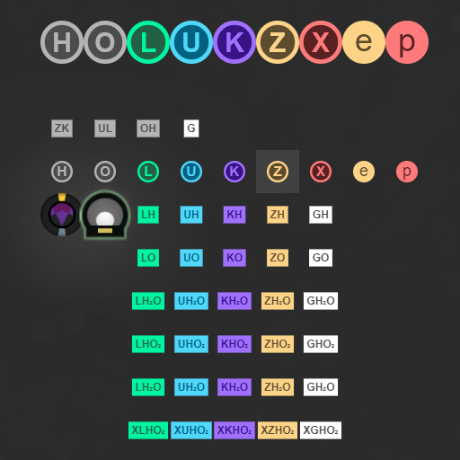

# RoomVisual

Prototype extension methods for `RoomVisual` object in [screeps](https://screeps.com). Including structures, road
connections, speech, resource icons, and even animated position markers.

## Installation

Place a copy of the `RoomVisual.js` file from this repository in your project's directory. ie. `path/to/RoomVisual.js`

## Usage

Require the downloaded file before your main loop.

```javascript
require('./path/to/RoomVisual')
```

### Structure

Draws `structureType` at `x`, `y`.

```javascript
// .structure(x, y, structureType)
room.visual.structure(8, 13, STRUCTURE_TOWER)
```

### Connect Roads

Connects roads drawn with the above `.structure()` the same way the game would.

```javascript
// .connectRoads()
room.visual.connectRoads()
```

### Speech

Simulates `creep.say()` through room visuals.

```javascript
// .speech(text, x, y)
room.visual.speech('Hello World', 22, 24)
```

### Animated Position

Animates a marker at `x`, `y`.

```javascript
// .animatedPosition(x, y)
room.visual.animatedPosition(12, 32)
```

### Resource badges



Draws resource icon of `type` at `x`, `y`, and given `size`.
Size defaults to `0.25`.

```javascript
// .resource(type, x, y)
room.visual.resource("XGHO2", 12, 32)
// .resource(type, x, y, size)
room.visual.resource("K", 12, 32, 0.5)
```