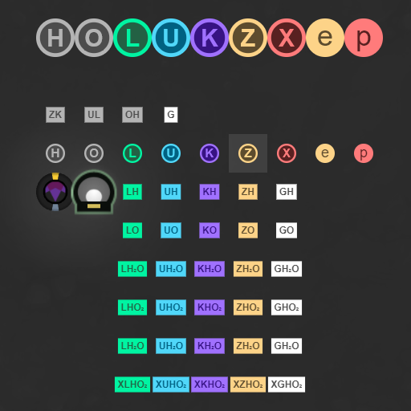

# RoomVisual

Prototype extension methods for `RoomVisual` object in [screeps](https://screeps.com). Including structures, road
connections, speech, resource icons, and even animated position markers.

## Installation

**Screeps (copy the file).** Download [`RoomVisual.js` from the latest release](https://github.com/screepers/RoomVisual/releases/latest/download/RoomVisual.js) into your code folder. Older versions are on the [releases page](https://github.com/screepers/RoomVisual/releases). To build it yourself, run `pnpm install && pnpm build` and use `dist/screeps/RoomVisual.js`.

```javascript
require('./RoomVisual')
```

**npm.** [`@screepers/room-visual`](https://www.npmjs.com/package/@screepers/room-visual) ships ESM, CJS and types (needs `@types/screeps` for TypeScript).

```javascript
// Patch RoomVisual.prototype (the methods below become available on room.visual)
import '@screepers/room-visual/register'

// ...or import only what you use (tree-shakable, no side effects)
import { structure, resource } from '@screepers/room-visual'
structure(room.visual, 8, 13, STRUCTURE_TOWER)
```

## Usage

### Structure

Draws `structureType` at `x`, `y`.

```javascript
// .structure(x, y, structureType)
room.visual.structure(8, 13, STRUCTURE_TOWER)
```

### Connect Roads

Connects roads drawn with the above `.structure()` the same way the game would.

```javascript
// .connectRoads()
room.visual.connectRoads()
```

### Speech

Simulates `creep.say()` through room visuals.

```javascript
// .speech(text, x, y)
room.visual.speech('Hello World', 22, 24)
```

### Animated Position

Animates a marker at `x`, `y`.

```javascript
// .animatedPosition(x, y)
room.visual.animatedPosition(12, 32)
```

### Resource badges



Draws resource icon of `type` at `x`, `y`, and given `size`.
`size` is the badge radius in grid units, so `0.5` fills one tile. It defaults to `0.25`, except
for symbol resources, which default to `0.5` (one full tile).

```javascript
// .resource(type, x, y)
room.visual.resource("XGHO2", 12, 32)
// .resource(type, x, y, size)
room.visual.resource("K", 12, 32, 0.5)
```